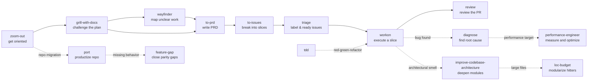

# Engineering skills

Skills for code work — bug-hunting, design, planning, review, and execution.

## Skills

- **[branch-conventions](./branch-conventions/README.md)** — Standard branch naming and creation flow using conventional prefixes and an up-to-date default branch.
- **[ci-monitoring](./ci-monitoring/README.md)** — Monitor GitHub PR checks, rerun failed jobs when appropriate, and confirm merge-readiness.
- **[commit-conventions](./commit-conventions/README.md)** — Keep commit messages aligned with branch intent using conventional commit types.
- **[diagnose](./diagnose/README.md)** — Disciplined diagnosis loop for hard bugs and performance regressions: reproduce → minimise → hypothesise → instrument → fix → regression-test.
- **[feature-gap](./feature-gap/README.md)** — Compare a source GitHub repository against a destination repository, identify real missing functionality, implement it destination-natively, then commit and push to the destination default branch.
- **[git-commit](./git-commit/README.md)** — Safe commit-message workflow using temp files and `git commit -F` to avoid shell-substitution pitfalls.
- **[git-safety](./git-safety/README.md)** — Guardrails for safe git operations: stash/cherry-pick preference, force-push constraints, and destructive-command avoidance.
- **[grill-with-docs](./grill-with-docs/README.md)** — Code-aware grilling session that challenges your plan against the existing domain model and updates `CONTEXT.md` / ADRs inline.
- **[improve-codebase-architecture](./improve-codebase-architecture/README.md)** — Surface architectural friction and propose deepening opportunities — refactors that turn shallow modules into deep ones.
- **[loc-budget](./loc-budget/README.md)** — Find large line-count hitters, modularize them into cohesive files, and add file-size and flat-directory budget gates in the repo's idiomatic tooling.
- **[performance-engineer](./performance-engineer/README.md)** — Measure, diagnose, and improve software performance on a specific critical path with bounded experiments and before/after evidence.
- **[pr-monitor](./pr-monitor/README.md)** — One-pass PR monitor that processes bot review feedback, CI failures, and merge-readiness signals.
- **[pr-workflow](./pr-workflow/README.md)** — Create and update PRs with clear reviewer-focused descriptions and mergeability checks.
- **[port](./port/README.md)** — Port an upstream GitHub repository into a fresh private destination repository with a new identity, clean single-commit history, detailed docs, CI/pre-commit/Flox setup, structure cleanup, and upstream-reference sanitization.
- **[review](./review/README.md)** — Read-only, high-signal review for pull requests or local change sets using scope, ticket context, full diff context, and relevant tests.
- **[tdd](./tdd/README.md)** — Test-driven development with a red-green-refactor loop. Vertical slices via tracer bullets — one test, one implementation, repeat.
- **[to-issues](./to-issues/README.md)** — Break a plan, spec, or PRD into independently-grabbable issues using tracer-bullet vertical slices.
- **[to-prd](./to-prd/README.md)** — Turn the current conversation context into a PRD and publish it to the project issue tracker.
- **[triage](./triage/README.md)** — Move issues through a small state machine of triage roles (`needs-triage`, `needs-info`, `ready-for-agent`, `ready-for-human`, `wontfix`).
- **[wayfinder](./wayfinder/README.md)** — Plan work too large or unclear for one agent session by creating an issue-tracker map and resolving one frontier decision ticket at a time.
- **[workon](./workon/README.md)** — Pick up a Linear ticket end-to-end: worktree, implement, PR, then watch the PR on a 5-minute loop addressing review comments, CI failures, and merge conflicts until merged.
- **[workon-event](./workon-event/README.md)** — Event-driven `/workon` companion that handles one ticket event per invocation via a dispatcher.
- **[zoom-out](./zoom-out/README.md)** — Tell the agent to zoom out and give a higher-level perspective on an unfamiliar section of code.

## How they fit together

Use them à la carte — there's no enforced pipeline.

## Attribution

Most engineering skills are ported from
[mattpocock/skills](https://github.com/mattpocock/skills) under MIT —
`workon` and `review` are dotbrains originals. See
[THIRD_PARTY_LICENSES.md](../../THIRD_PARTY_LICENSES.md) for full attribution.
