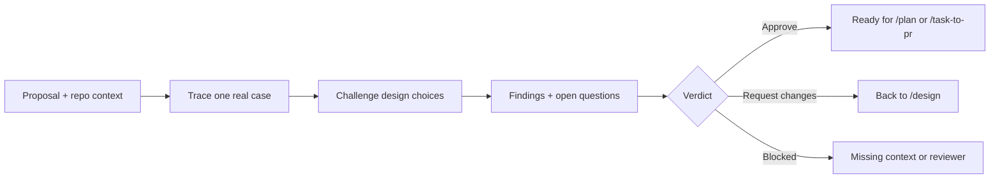

# /architecture-review

Read-only review of a technical proposal — design, RFC, ADR, or issue —
**before** any code is written. A fresh subagent that did not write the
proposal challenges it for correctness, scale, performance, security,
operations, and proof, then returns one verdict.

1. Read the proposal, repository instructions, current code, tests, schemas, and linked material.
2. State the problem, affected user, outcome, scope, constraints, and main tradeoff.
3. Trace one real case end to end, including failure, retry, and cleanup where they matter.
4. Challenge the chosen design for a simpler option with the same outcome and proof.
5. Surface material open questions with a recommended answer where evidence supports one.
6. Return findings, open questions, and a verdict — never a rewrite, a plan, or an implementation.

## Flow



## Install

```bash
npx skills@latest add dotbrains/skills
```

## Usage

```text
/architecture-review docs/event-pipeline/design.md
/architecture-review https://github.com/owner/repo/issues/456
```

## Output

- **Findings** — `Blocker` or `Important`, each with location, concrete failure or ambiguity, impact, evidence, and the smallest correction.
- **Open questions** — `Blocking` or `Important`, each with a recommended answer when evidence supports one.
- **Verdict** — exactly one of `Approve`, `Request changes`, or `Blocked`, plus what remains unverified.

## When not to use this

- The change already has code — use [`review`](../review/README.md) instead.
- You want an interactive back-and-forth rather than a written verdict — use
  [`grill-with-docs`](../grill-with-docs/README.md) or
  [`grill-me`](../../productivity/grill-me/README.md).

## Files

- [`SKILL.md`](./SKILL.md) — canonical skill definition.

## Attribution

Ported from [owainlewis/blueprint](https://github.com/owainlewis/blueprint/tree/main/skills/architecture-review) under MIT. See [THIRD_PARTY_LICENSES.md](../../../THIRD_PARTY_LICENSES.md).
