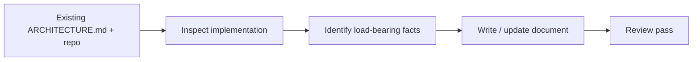

# /architecture

Create or update a root `ARCHITECTURE.md` that documents the system that
exists in code today — not a proposal, not a roadmap.

1. Read any existing `ARCHITECTURE.md` and repository instructions.
2. Inspect manifests, entry points, config, schemas, migrations, infra, tests, and a few critical flows.
3. Identify the source of truth, dependency direction, trust boundaries, and the one rule a contributor must not break.
4. Write or update the document, verifying every concrete claim against code, config, schemas, infra, or tests.
5. Run a review pass for truth, shape, boundaries, mechanics, maintenance, and separation of current-state from proposals.

## Flow



## Install

```bash
npx skills@latest add smeltery/skills
```

## Usage

```text
/architecture
/architecture Bring the architecture document back in line with the current code.
```

## Output

A root `ARCHITECTURE.md` with an executive summary, system diagram, dependency
hierarchy, critical-flow walkthroughs, component ownership boundaries, a
source map, and a verification section naming the evidence behind each claim.

## When not to use this

- Deciding how a *new* system or change should work — use
  [`design`](../design/README.md) instead.
- A quick, informal orientation you don't need to persist — use
  [`zoom-out`](../zoom-out/README.md).
- Finding refactoring opportunities in the current structure — use
  [`improve-codebase-architecture`](../improve-codebase-architecture/README.md).

## Files

- [`SKILL.md`](./SKILL.md) — canonical skill definition.

## Attribution

Ported from [owainlewis/blueprint](https://github.com/owainlewis/blueprint/tree/main/skills/architecture) under MIT. See [THIRD_PARTY_LICENSES.md](../../../THIRD_PARTY_LICENSES.md).
