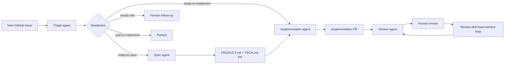

# /cloud-factory

Convert a GitHub repository into a cloud software factory with agent skills,
workflow triggers, labels, and domain-doc placeholders.

## Install

```bash
npx skills@latest add smeltery/skills --skill cloud-factory --agent codex --yes
```

## Usage

```text
/cloud-factory
```

The skill installs the reusable assets from
[smeltery/cloud-factory](https://github.com/smeltery/cloud-factory) into the
current repository and verifies the factory scaffold.

## Factory flow



## Files

- [`SKILL.md`](./SKILL.md) — canonical skill definition.
