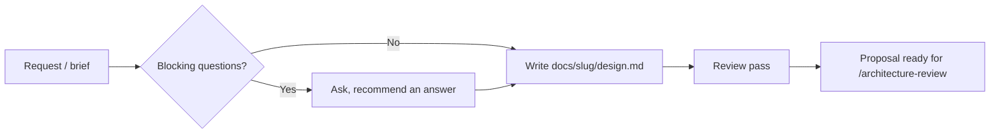

# /design

Write a rigorous design document for a proposed feature or system change —
behavior, interfaces, failures, security, acceptance criteria, and test
approach — with numbered `INV-n` invariants and `AC-n` acceptance criteria
that stay stable across review, planning, and verification.

1. Read the request, repository instructions, relevant code, and linked material.
2. Ask only blocking questions before drafting; record the rest as open questions with a recommended default.
3. Write `docs/<feature-slug>/design.md` using the 13-section numbered shape.
4. Run the review pass (architecture fit, names/identity, failure/recovery, security, shared resources, timing, lifecycle, undefined terms, either/or criteria).
5. Stop with a proposal ready for review — do not plan or implement it.

## Flow



## Install

```bash
npx skills@latest add smeltery/skills
```

## Usage

```text
/design Add idempotent webhook delivery to the notifications service.
```

## Output

`docs/<feature-slug>/design.md` with executive summary, system context,
proposed design, `INV-n` invariants and requirements, interfaces and data,
failure behavior and lifecycle, security/privacy/operations, `AC-n`
acceptance criteria, test approach, risks, open questions, and out-of-scope
items.

## When not to use this

- The decision is small enough not to need numbered invariants — use
  [`to-prd`](../to-prd/README.md) or [`grill-with-docs`](../grill-with-docs/README.md).
- The repository needs a document of *current*, not proposed, behavior — use
  [`architecture`](../architecture/README.md).

## Files

- [`SKILL.md`](./SKILL.md) — canonical skill definition.

## Attribution

Ported from [owainlewis/blueprint](https://github.com/owainlewis/blueprint/tree/main/skills/design) under MIT. See [THIRD_PARTY_LICENSES.md](../../../THIRD_PARTY_LICENSES.md).
