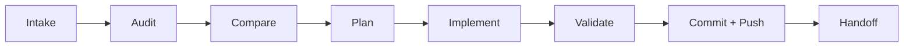
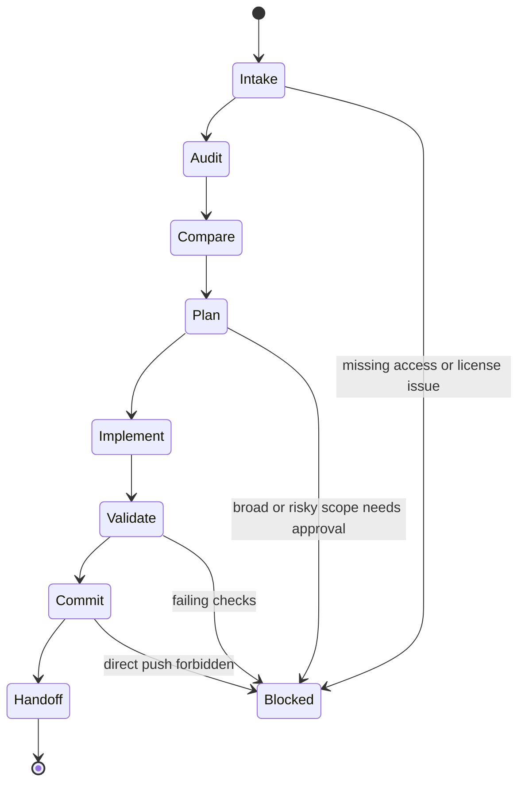

# /feature-gap

Portable `/feature-gap` skill for comparing a source GitHub repository against a
destination repository, identifying real missing functionality, and landing
clean destination-native changes on the destination default branch.

1. Inspect source and destination with `gh`.
2. Audit product surface, tests, docs, architecture, and tooling in both repos.
3. Build a feature-gap matrix and reject branding, infrastructure, deprecated,
   or already-equivalent differences.
4. Plan the smallest coherent feature slice.
5. Implement in the destination repo only.
6. Validate with destination-local checks.
7. Commit and push to the destination default branch when policy allows.

## Lifecycle



The skill is stateful and resumable. Re-running the same invocation resumes from
`~/.claude/feature-gap/<source>__<destination>.json`, while GitHub and the local
filesystem remain the source of truth.



## Install

Via the dotbrains skills CLI flow:

```bash
npx skills@latest add dotbrains/skills
```

Or copy just this skill:

```bash
mkdir -p ~/.claude/skills/feature-gap
curl -fsSL https://raw.githubusercontent.com/dotbrains/skills/main/skills/engineering/feature-gap/SKILL.md \
  -o ~/.claude/skills/feature-gap/SKILL.md
```

## Usage

```text
/feature-gap https://github.com/source-owner/source-repo owner/destination-repo
```

If the destination repo is omitted, the skill uses the current GitHub repository
when `gh repo view` can discover it.

## Requirements

- `git`
- `gh` CLI authenticated against GitHub
- Permission to read the source repository
- Permission to commit and push to the destination default branch
- Local build/test tools required by the destination project

## Files

- [`SKILL.md`](./SKILL.md) — canonical skill definition consumed by the agent.
