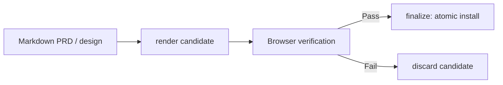

# /html-doc

Render a finished Markdown PRD or technical design into one verified,
self-contained static HTML page. The Markdown stays canonical — this skill
only changes presentation, never meaning, and never publishes anything.

1. Read and classify the source (`prd` or `design`, inferred from `prd.md`/`design.md` or stated explicitly).
2. Render a locked candidate with `scripts/html_doc.py render`.
3. Verify the candidate in a real browser: responsive widths, print preview, keyboard order, focus, unique IDs, console errors, and no network access.
4. Finalize (atomic install) or discard the candidate — never hand-edit the generated HTML.

## Flow



## Install

```bash
npx skills@latest add dotbrains/skills
```

Then install the locked Mermaid dependency tree once, from this skill's
directory:

```bash
npm ci --prefix ~/.claude/skills/html-doc
```

## Usage

```text
/html-doc docs/checkout-redesign/design.md
/html-doc docs/account-recovery/prd.md
```

## Output

A single static HTML file: semantic markup, inline CSS, no runtime
JavaScript, no external resources, Mermaid diagrams embedded as validated
base64 SVG with their source kept in a disclosure, plus responsive and print
styles.

## Requirements

- Python 3.11+
- Pandoc 3+
- Node.js 22.12+ and npm (only needed once, to install the locked Mermaid
  CLI via `npm ci`)

## Files

- [`SKILL.md`](./SKILL.md) — canonical skill definition.
- [`scripts/html_doc.py`](./scripts/html_doc.py) — render / finalize / discard CLI; the only supported way to generate or install output.
- [`assets/`](./assets/) — shared stylesheet and locked Mermaid/Puppeteer config.
- [`tests/`](./tests/) — `unittest` suite covering rendering, locking, and SVG sanitization; run with `python3 -m unittest skills/engineering/html-doc/tests/test_html_doc.py` after `npm ci`.

## When not to use this

- The source is only a rough brief, not a finished document — use
  [`to-prd`](../to-prd/README.md) or [`design`](../design/README.md) first.

## Attribution

Ported from [owainlewis/blueprint](https://github.com/owainlewis/blueprint/tree/main/skills/html-doc) under MIT, with the embedded generator identity and temp-file prefix renamed away from upstream branding. See [THIRD_PARTY_LICENSES.md](../../../THIRD_PARTY_LICENSES.md).
