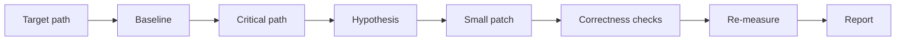

# /performance-engineer

Measure, diagnose, and improve software performance on a specific critical
path. The skill keeps performance work evidence-backed: baseline first,
smallest useful change, repeatable after measurement, and behavior checks.

Use it for startup time, page load, API latency, p95/p99, database query count,
frontend rendering, memory/CPU, import or bundle cost, batch jobs, file
processing, and algorithmic hotspots.

## Flow



## Install

Via the dotbrains skills CLI flow:

```bash
npx skills@latest add dotbrains/skills
```

Or copy just this skill:

```bash
mkdir -p ~/.claude/skills/performance-engineer
curl -fsSL https://raw.githubusercontent.com/dotbrains/skills/main/skills/engineering/performance-engineer/SKILL.md \
  -o ~/.claude/skills/performance-engineer/SKILL.md
```

## Usage

```text
/performance-engineer Reduce p95 latency on GET /api/search
/performance-engineer Speed up CLI startup time
/performance-engineer Find why this React table drops frames
```

## Requirements

- A specific path or workload to measure.
- Local test/build tools for the target repository.
- Profilers, logs, browser tooling, or benchmark commands appropriate to the
  stack.

## Files

- [`SKILL.md`](./SKILL.md) — canonical skill definition consumed by the agent.
