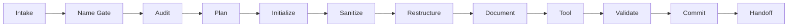
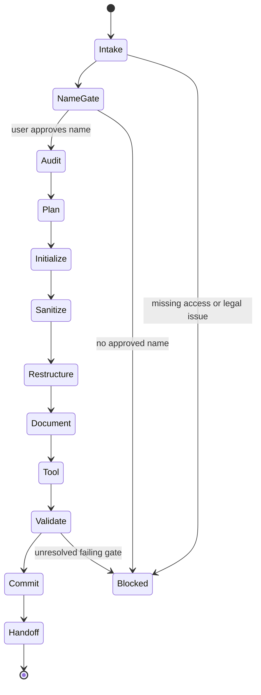

# /port

Portable `/port` skill for turning an upstream GitHub repository into a fresh
private destination repository with a new identity, clean history, documentation,
tooling, and validation.

1. Inspect the source repo and destination access through `gh`.
2. Require an explicitly approved, unique new destination repo name.
3. Audit source structure, tooling, docs, CI, legal notices, large files, flat
   directories, and upstream identity references.
4. Create a private destination repo without preserving upstream Git history.
5. Sanitize upstream identity, improve structure, split large implementation
   files where useful, and write detailed docs.
6. Configure CI with Blacksmith runners, pre-commit hooks, and Flox where
   practical.
7. Validate the repo and push exactly one fresh initial commit.

## Lifecycle



The skill is stateful and resumable. Re-running the same invocation resumes from
`~/.claude/port/<source-owner>-<source-repo>.json`, while GitHub and the local
filesystem remain the source of truth.



## Install

Via the dotbrains skills CLI flow:

```bash
npx skills@latest add dotbrains/skills
```

Or copy just this skill:

```bash
mkdir -p ~/.claude/skills/port
curl -fsSL https://raw.githubusercontent.com/dotbrains/skills/main/skills/engineering/port/SKILL.md \
  -o ~/.claude/skills/port/SKILL.md
```

## Usage

```text
/port https://github.com/source-owner/source-repo
```

The skill asks for the destination owner when it cannot be inferred, then stops
until the user approves the new repository name.

## Requirements

- `git`
- `gh` CLI authenticated against GitHub
- Permission to read the source repository
- Permission to create or initialize a private destination repository
- Local build/test tools required by the source project

## Files

- [`SKILL.md`](./SKILL.md) — canonical skill definition consumed by the agent.
