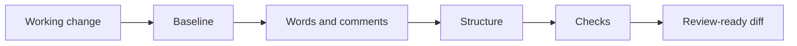

# /simplify

Portable `/simplify` skill for the last behavior-preserving cleanup before
human review. It tightens names and comments, removes branch-history artifacts,
reduces overlapping concepts, and checks that the final diff remains easy to
explain.

## Flow



## Install

```bash
npx skills@latest add dotbrains/skills
```

Or copy just this skill:

```bash
mkdir -p ~/.claude/skills/simplify
curl -fsSL https://raw.githubusercontent.com/dotbrains/skills/main/skills/engineering/simplify/SKILL.md \
  -o ~/.claude/skills/simplify/SKILL.md
```

## Usage

```text
/simplify
/simplify src/workspace
/simplify main...HEAD
```

The skill is also intended to run automatically once a scoped implementation
works and the relevant checks pass, and whenever code comments are written or
reviewed.

## Requirements

- A working implementation or comment-only review scope
- Repository-local format, lint, type-check, and test commands when available
- Version-control context for separating the task from unrelated user work

## Files

- [`SKILL.md`](./SKILL.md) — canonical skill definition consumed by the agent.

## Attribution

Adapted from
[`bholmesdev/skills` — `simplify`](https://github.com/bholmesdev/skills/tree/main/skills/simplify)
under MIT. See [THIRD_PARTY_LICENSES.md](../../../THIRD_PARTY_LICENSES.md).
