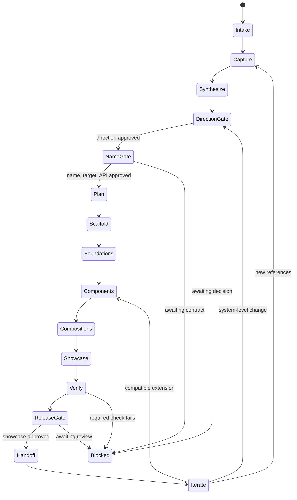

# /ui-studio

Use Playwright CLI to investigate live websites, runnable repository UIs, or
curated design-library references such as Mobbin, then turn the evidence into an
original, named UI kit with reusable tokens and components, representative
compositions, and a runnable, hostable showcase.

The skill studies references as evidence rather than cloning them. It navigates
and exercises reference interactions with Playwright CLI, applies explicit
rights and evidence-retention policies, synthesizes a coherent design language,
waits at three meaningful gates, verifies real package consumption and
production hosting, and preserves state for safe later iteration.

## Lifecycle



State is stored with the target at `.ui-studio/<kit-slug>/state.json`. The
filesystem and kit manifest remain authoritative, and generated-file hashes
prevent a resumed run from silently overwriting hand edits.

## Usage

```text
/ui-studio https://example.com https://example.org/products --kit Northstar
/ui-studio <mobbin-share-link> --kit Northstar
```

References may be URLs, Mobbin or comparable design-library deep links,
repositories, attached screenshots, or local paths. The user can also point a
later invocation at an existing kit and request another component, theme, page
composition, or visual direction.

For curated design libraries, the skill preserves screen order and flow context
instead of treating every frame as an unrelated image. If the provider requires
authentication, the user completes it in the isolated Playwright session; the
skill never handles their credentials.

A repository can be the reference even when no public site exists. The skill
discovers the relevant app, package manager, setup and start commands from that
repository, starts the UI as a managed local process, and feeds its actual served
URL into the Playwright investigation loop. It records the commit and runtime
recipe while leaving tracked reference files unchanged.

The skill requires Playwright CLI and a compatible browser for navigable web or
repository references, plus the build tools used by the reference and selected
target projects. It also uses Playwright CLI to exercise the finished showcase
at multiple viewports and inspect interaction, accessibility, console, and
network behavior.

Bundled dependency-free Python tools discover repository UI entry points and
named kits, validate runtime state and `ui-kit.json` manifests against portable
schemas, enforce legal workflow transitions, generate repeatable capture
harnesses and production verifiers, detect stale evidence, classify public API
and multi-kit compatibility, exchange DTCG-shaped tokens, govern visual
baselines and provenance, and report generated-file drift. Disposable dogfood
runners exercise Playwright and four real framework consumers without retaining
browser evidence or dependency installations.

The official Playwright path uses `codegen` for headed or user-authenticated
exploration and short scratch Playwright Test specs for repeatable autonomous
capture. Agent-oriented Playwright CLIs are supported when their own help exposes
interactive session commands; the skill never invents unavailable commands.

## Tooling

```bash
python3 scripts/doctor.py --root /path/to/repository
python3 scripts/validate-kit.py --check-files /path/to/kit
python3 scripts/state.py status /path/to/state.json
python3 scripts/make-capture.py --url https://example.com \
  --hypothesis "How does navigation expose state?" --out /tmp/capture
python3 scripts/check-evidence.py /path/to/evidence.json
python3 scripts/compare-kits.py old/ui-kit.json new/ui-kit.json
python3 scripts/compose-kits.py first/ui-kit.json second/ui-kit.json
python3 scripts/benchmark.py plan fixtures/benchmark/benchmark.json
python3 scripts/tokens.py validate /path/to/tokens.json
./scripts/dogfood.sh
./scripts/dogfood-portability.sh
```

The doctor does not execute discovered repository scripts. The dogfood runner
uses a disposable copy and may download Playwright Test or Chromium when they are
not already available; see `DOGFOOD.md` for overrides and host prerequisites.

## Install

```bash
npx skills@latest add dotbrains/skills
```

## Files

- [`SKILL.md`](./SKILL.md) — canonical skill definition consumed by the agent.
- [`REFERENCES.md`](./REFERENCES.md) — intake, rights, privacy, repository and
  curated-reference capture, evidence ledger, and design synthesis.
- [`PLAYWRIGHT.md`](./PLAYWRIGHT.md) — executable browser exploration and
  production-verification protocol.
- [`RECORDINGS.md`](./RECORDINGS.md) — ordered, confidence-labeled evidence from
  video and animated UI references.
- [`SANDBOX.md`](./SANDBOX.md) — optional read-only container isolation for
  executing unfamiliar repository references.
- [`BUILD.md`](./BUILD.md) — foundations, components, distribution, showcase,
  consumer testing, performance budgets, hosting, release, and handoff.
- [`CRITIQUE.md`](./CRITIQUE.md) — evidence-based structural and finish review
  before the Release gate.
- [`QUALITY.md`](./QUALITY.md) — benchmarks, observations, verification,
  compatibility, tokens, visual approval, provenance, and portability.
- [`DOGFOOD.md`](./DOGFOOD.md) — automated local and manual acceptance matrix
  for the skill itself.
- [`schemas/`](./schemas/) — portable workflow, evidence, observation,
  verification, benchmark, visual-baseline, and provenance contracts.
- [`templates/`](./templates/) — source-ledger, critique, accessibility,
  verification, and provenance starting points.
- [`scripts/doctor.py`](./scripts/doctor.py) — read-only UI/tooling/kit discovery.
- [`scripts/validate-kit.py`](./scripts/validate-kit.py) — dependency-free schema,
  path, and generated-hash validation.
- [`scripts/state.py`](./scripts/state.py) — legal transitions, gate receipts,
  atomic migration, and generated-file adoption.
- [`scripts/make-capture.py`](./scripts/make-capture.py) — disposable Playwright
  capture-plan and spec generator.
- [`scripts/make-verifier.py`](./scripts/make-verifier.py) — production traversal
  and verification-receipt generator.
- [`scripts/check-evidence.py`](./scripts/check-evidence.py) — age, fingerprint,
  and local repository revision checks.
- [`scripts/compare-kits.py`](./scripts/compare-kits.py) — manifest compatibility
  and minimum version-bump classification.
- [`scripts/compose-kits.py`](./scripts/compose-kits.py) — cross-kit identity,
  peer, token, and global-style conflict detection.
- [`scripts/benchmark.py`](./scripts/benchmark.py) — evidence-backed quality-suite
  planning and result evaluation.
- [`scripts/tokens.py`](./scripts/tokens.py) — DTCG-compatible token validation,
  flattening, and expansion.
- [`scripts/provenance.py`](./scripts/provenance.py) — asset/license inventory
  completeness checks.
- [`scripts/visual-baselines.py`](./scripts/visual-baselines.py) — explicit visual
  approval records and exact drift detection.
- [`scripts/sandbox-reference.sh`](./scripts/sandbox-reference.sh) — constrained
  local container runner for unknown repository code.
- [`scripts/check-portability.py`](./scripts/check-portability.py) and
  [`scripts/dogfood-portability.sh`](./scripts/dogfood-portability.sh) — static
  contracts and real React/Vue/Svelte/web-component production builds.
- [`scripts/test-tooling.py`](./scripts/test-tooling.py) — disposable control-plane
  recovery and idempotency tests.
- [`scripts/dogfood.sh`](./scripts/dogfood.sh) — disposable local Playwright
  acceptance run using the bundled fixture.
- [`fixtures/`](./fixtures/) — static reference app and Playwright dogfood
  harness used only in disposable copies.
