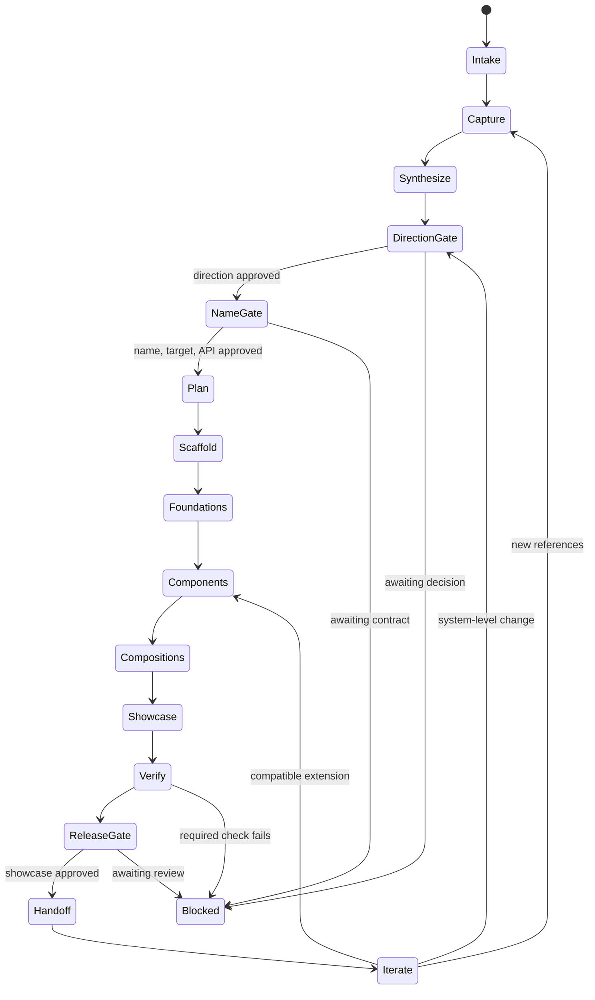

# /ui-studio

Use Playwright CLI to investigate live websites, runnable repository UIs, or
curated design-library references such as Mobbin, then turn the evidence into an
original, named UI kit with reusable tokens and components, representative
compositions, and a runnable, hostable showcase.

The skill studies references as evidence rather than cloning them. It navigates
and exercises reference interactions with Playwright CLI, synthesizes a coherent
design language, waits for explicit approval at three meaningful gates, builds
against the target repository's conventions, and preserves state so later
sessions can continue iterating the same kit safely.

## Lifecycle



State is stored with the target at `.ui-studio/<kit-slug>/state.json`. The
filesystem and kit manifest remain authoritative, and generated-file hashes
prevent a resumed run from silently overwriting hand edits.

## Usage

```text
/ui-studio https://example.com https://example.org/products --kit Northstar
/ui-studio <mobbin-share-link> --kit Northstar
```

References may be URLs, Mobbin or comparable design-library deep links,
repositories, attached screenshots, or local paths. The user can also point a
later invocation at an existing kit and request another component, theme, page
composition, or visual direction.

For curated design libraries, the skill preserves screen order and flow context
instead of treating every frame as an unrelated image. If the provider requires
authentication, the user completes it in the isolated Playwright session; the
skill never handles their credentials.

A repository can be the reference even when no public site exists. The skill
discovers the relevant app, package manager, setup and start commands from that
repository, starts the UI as a managed local process, and feeds its actual served
URL into the Playwright investigation loop. It records the commit and runtime
recipe while leaving tracked reference files unchanged.

The skill requires Playwright CLI and a compatible browser for navigable web or
repository references, plus the build tools used by the reference and selected
target projects. It also uses Playwright CLI to exercise the finished showcase
at multiple viewports and inspect interaction, accessibility, console, and
network behavior.

## Install

```bash
npx skills@latest add dotbrains/skills
```

## Files

- [`SKILL.md`](./SKILL.md) — canonical skill definition consumed by the agent.
