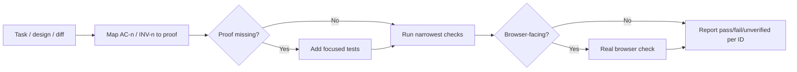

# /verify

Prove that a code change meets its stated acceptance criteria — map every
`AC-n`/`INV-n` ID (or task criterion) to concrete evidence, add focused tests
where proof is missing, and require a real browser check for browser-facing
work.

1. Read the task, source design, changed code, and existing tests; preserve `AC-n`/`INV-n` IDs verbatim.
2. Map every criterion, invariant, and affected failure path to proof by ID.
3. Add or update focused tests where proof is missing; assertions must fail if the behavior breaks.
4. Run the narrowest checks that exercise the changed behavior, widening only when shared interfaces changed.
5. For browser-rendered changes, check desktop/mobile, keyboard use, console errors, and failed requests in a real browser.
6. Report each ID as pass, fail, or unverified with its evidence.

## Flow



## Install

```bash
npx skills@latest add smeltery/skills
```

## Usage

```text
/verify AC-3 and INV-1 from docs/webhook-delivery/design.md against the current branch
/verify https://github.com/owner/repo/pull/123
```

## Output

A per-ID report (`AC-n`, `INV-n`, or task criterion) marked pass, fail, or
unverified, each with the command, browser flow, or other evidence that
backs it.

## When not to use this

- Building new behavior test-first — use [`tdd`](../tdd/README.md); this skill
  verifies against stated criteria after the fact, on your own or someone
  else's change.
- An independent read of the implementation itself — use
  [`review`](../review/README.md).

## Files

- [`SKILL.md`](./SKILL.md) — canonical skill definition.

## Attribution

Ported from [owainlewis/blueprint](https://github.com/owainlewis/blueprint/tree/main/skills/test) under MIT, renamed from `test` to `verify` to avoid confusion with `tdd`. See [THIRD_PARTY_LICENSES.md](../../../THIRD_PARTY_LICENSES.md).
