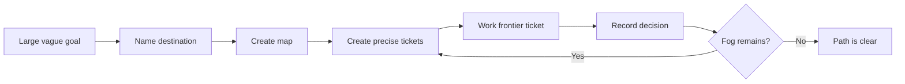

# /wayfinder

Portable `/wayfinder` skill for planning work too large or unclear for one
agent session. It creates a shared map on the project issue tracker, breaks the
fog into decision tickets, and works one frontier ticket per session until the
path is clear.

1. Name the destination.
2. Create a parent map issue.
3. Add precise child decision tickets.
4. Keep vague but in-scope uncertainty as fog.
5. Resolve one frontier ticket per session.
6. Record decisions back on the map.

## Lifecycle



## Install

Via the smeltery skills CLI flow:

```bash
npx skills@latest add smeltery/skills
```

Or copy just this skill:

```bash
mkdir -p ~/.claude/skills/wayfinder
curl -fsSL https://raw.githubusercontent.com/smeltery/skills/main/skills/engineering/wayfinder/SKILL.md \
  -o ~/.claude/skills/wayfinder/SKILL.md
```

## Usage

```text
/wayfinder Plan the migration from legacy billing to usage-based billing
/wayfinder https://github.com/org/repo/issues/123
```

With a vague idea, the skill charts a new map. With a map reference, it works
one frontier ticket.

## Requirements

- Access to the project issue tracker, or permission to use the local markdown
  fallback.
- Enough repo context to respect domain language, ADRs, and contributor docs.

## Files

- [`SKILL.md`](./SKILL.md) — canonical skill definition consumed by the agent.
