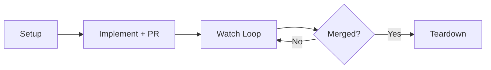
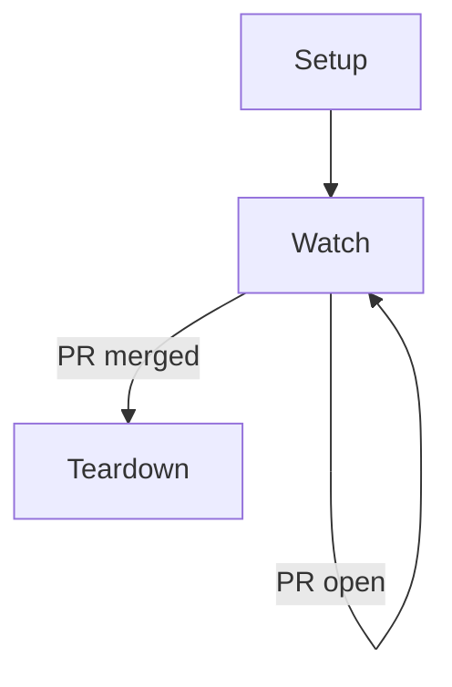

# /workon

Portable `/workon` skill for Linear-driven ticket execution: pick up a ticket
end-to-end, drive it from worktree creation through merge, and tear down
cleanly.

1. Load the Linear ticket via the Linear MCP — issue body, full comment thread, and relevant attachments (design docs, screenshots, linked PRs, cross-referenced tickets) — before touching the codebase.
2. Create an isolated worktree.
3. Sweep repo docs (`CLAUDE.md`, `AGENTS.md`, `CONTRIBUTING.md`, `.cursor/rules/`, lint config) and surface relevant skills for the ticket's domain.
4. Implement and open a PR — always as a **draft**; the skill never opens a PR ready-for-review or marks an existing draft ready, since that decision belongs to the human owner. When a local adversarial reviewer CLI (e.g. `codex`) is available, the skill converges the diff locally first (up to 5 rounds, hard cap 8) so the PR exists to run CI and record reasoning, not to iterate.
5. Watch PR health in a loop (AI review comments, CI, merge conflicts) — works the same on draft PRs. Reviewer findings are bucketed with a strict bar: fix only what is directly related or genuinely catastrophic, defer valid-but-unrelated findings to a follow-up ticket, note invalid ones with a one-line reason.
6. Tear down the worktree after merge.

## Lifecycle



The skill is **idempotent and stateful** — repeated invocations resume from the
current phase, with state cached in `~/.claude/workon/<TICKET-ID>.json` and
GitHub treated as the source of truth.



## Install

Via the dotbrains skills CLI flow:

```bash
npx skills@latest add dotbrains/skills
```

Or copy just this skill:

```bash
mkdir -p ~/.claude/skills/workon
curl -fsSL https://raw.githubusercontent.com/dotbrains/skills/main/skills/workon/SKILL.md \
  -o ~/.claude/skills/workon/SKILL.md
```

## Usage

```text
/workon ENG-66
```

The argument must match `[A-Z]+-\d+` (Linear-style ticket id). Re-running the
same invocation continues whatever phase the skill is in.

## Requirements

- `git`
- `gh` CLI authenticated against your GitHub host
- A connected **Linear MCP server** — the skill always uses MCP tools (e.g. `mcp__*Linear__get_issue`, `mcp__*Linear__save_comment`) for Linear reads and writes. If no Linear MCP is connected, the skill stops at §3.1 rather than falling back to the REST API.
- Loop scheduler support (for 5-minute watch ticks)

## Files

- [`SKILL.md`](./SKILL.md) — canonical skill definition consumed by the agent.
