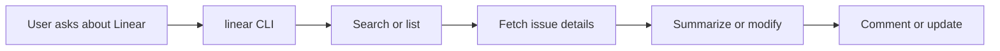

# linear

Use the `linear` CLI for Linear issue search, inspection, comments, workspace
metadata, and platform status.



## Install

```bash
npx skills@latest add smeltery/skills --skill linear
```

The skill expects the `linear` command from
[`@smeltery/linear-cli`](https://github.com/smeltery/linear-cli). If the CLI
is missing, the skill installs it from GitHub Packages when possible, or from
source as a fallback.

## Setup

```bash
npm config set @smeltery:registry https://npm.pkg.github.com
npm config set //npm.pkg.github.com/:_authToken "$(gh auth token)"
npm install -g @smeltery/linear-cli
linear --help
linear init
```

`linear init` configures the API key used by the CLI.

## Usage

Use when searching Linear, inspecting bugs or issues, posting comments, listing
labels/users/teams/projects, or checking Linear platform status.

## Files

- [`SKILL.md`](./SKILL.md) — canonical skill definition.
